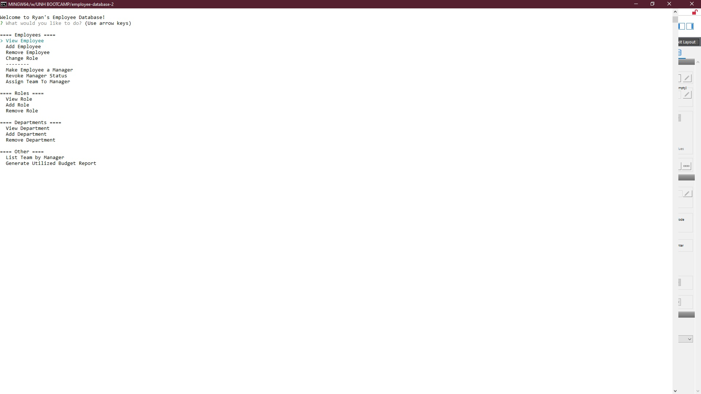

# Employee Database

## Table of Contents  

[Description](#Description)  
[Installation](#Installation)  
[Usage](#Usage)  
[License](#License)  
[Contributing](#Contributing)  
[Tests](#Tests)  
[Questions](#Questions)  

---

### Description

This app is uses node and MySQL to manage a database containing 3 tables; Departments, Roles, and Employees. Through the CLI, the user is allowed to Add/View/Remove Employees, Departments, and Roles, in addition to being able to create teams of employees operating under employees flagged as managers, and generate expense reports for the department table.

---

### Installation 

To install the application locally:  
1.  Clone the Repository to your local device.  
2.  Using your Terminal, run `npm install` in the directory of the cloned repository.  
3.  Install TablePlus or comparable SQL client.  
4.  Import `employee-database.sql` into your database.  
5.  From the `config` folder, type `node encrypt`  
6.  Input your database credentials.  
7.  From the root folder, run `node index`.
8.  Follow prompts.

---

### Usage

Feel free to use this program in whichever way you see fit.

---

### License

[License](./LICENSE)

---

### Contributing

Bootcamp Instructor:  
[Scott Byers](https://github.com/switch120)  

Bootcamp TA:  
[Michael Fearnley](https://michaelfearnley.com/)  

Technologies Used:  
[NPM](https://www.npmjs.com/)  
[Inquirer](https://www.npmjs.com/package/inquirer)  
[MySQL](https://www.npmjs.com/package/mysql)  
[TablePlus](https://tableplus.com/)  

---

### Questions

If you have any questions you can find my GitHub profile and E-Mail address below:  

[GitHub](https://github.com/rroyalty/)  
[E-Mail](rroyalty@gmail.com)